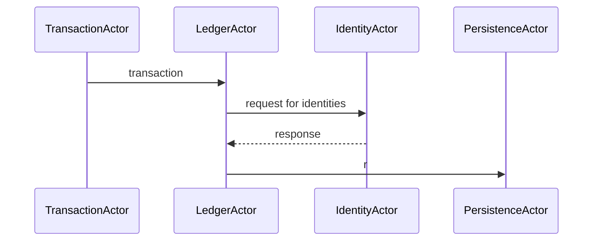

# Simple Ledger
Demo app made with Akka Typed Actors, Cats, Doobie and Oracle database.



## Usage
Download and run docker image with Oracle 12c.
```
$ docker run -d --name oracle \
  --privileged -v $(pwd)/oradata:/u01/app/oracle \
  -p 8080:8080 -p 1521:1521 absolutapps/oracle-12c-ee 
```
Run [init script](init/database.sql) as SYS user.
```
sqlplus sys/oracle@localhost:1521/orcl as sysdba @database.sql
```

Set environment variables.
```
export ORA_USERNAME=SIMPLE_LEDGER_APP
export ORA_PASSWORD=SIMPLE_LEDGER
export ORA_CONNECTION_STRING=jdbc:oracle:thin:@localhost:1521:orcl
```

Create fat JAR
```
sbt assembly
```

Run application with parameter
```
java -jar ./target/scala-2.13/SimpleLedger.jar /application.conf
```